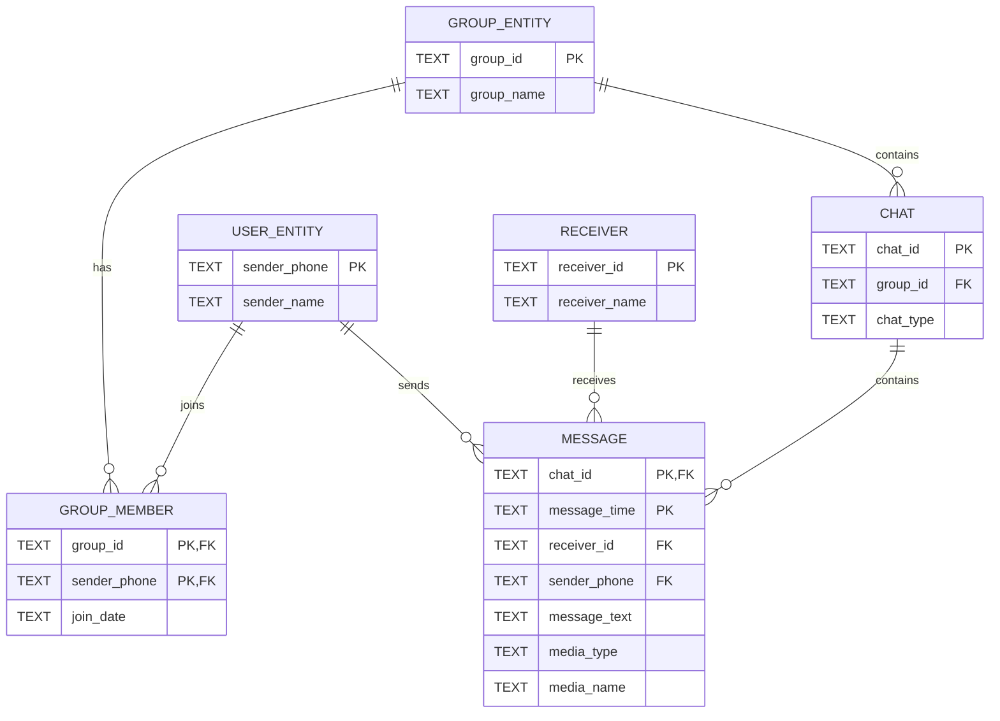

# Messaging Database Design

This example shows how I normalised a flat messaging dataset into a relational database.

## Problem

The original flat structure repeated user names, group names and identifiers across many message rows. That can create update anomalies because the same fact may need to be changed in several places.

## Final 3NF Structure

## Key Design Decisions

### Message primary key
`(chat_id, message_time)`

### Group data
Group names are stored once rather than repeated in every message.

### User data
User information is separated from message data so a user name can be updated in one place.

### Group membership
`Group_Member` resolves the many-to-many relationship between users and groups.

## SQL View

The database also includes a view called `v_studygroup_media`, which combines message, chat, group and user information to return media messages from the `StudyGroup`.
