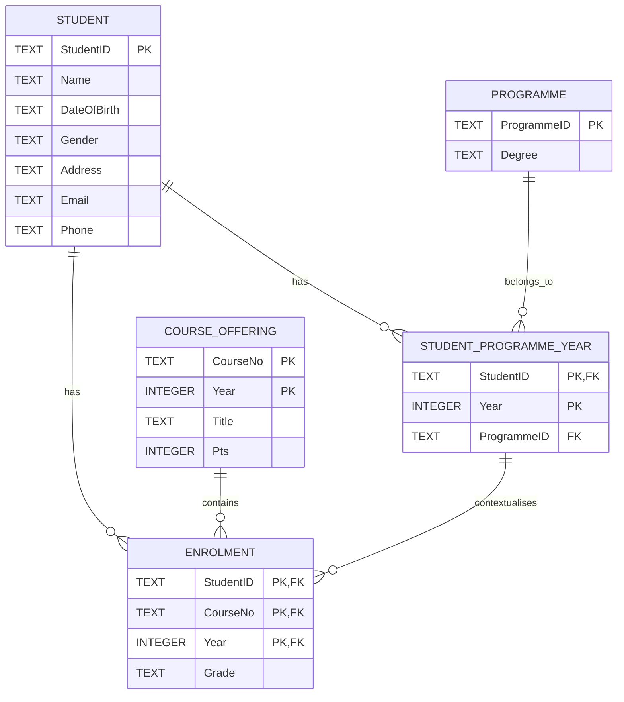

# Student Management Database Design

This example shows a normalised relational design created from student, programme, course and enrolment information.

## Final 3NF Structure

## Tables

### STUDENT
Primary key: `StudentID`

### PROGRAMME
Primary key: `ProgrammeID`

### STUDENT_PROGRAMME_YEAR
Primary key: `(StudentID, Year)`

Foreign keys:
- `StudentID` → `STUDENT`
- `ProgrammeID` → `PROGRAMME`

### COURSE_OFFERING
Primary key: `(CourseNo, Year)`

### ENROLMENT
Primary key: `(StudentID, CourseNo, Year)`

Foreign keys:
- `StudentID` → `STUDENT`
- `(CourseNo, Year)` → `COURSE_OFFERING`
- `(StudentID, Year)` → `STUDENT_PROGRAMME_YEAR`

## Normalisation

The design was developed by identifying functional dependencies and moving from a flat structure through:

**1NF → 2NF → 3NF**

The final structure reduces duplicated data and preserves historical programme and course information.
